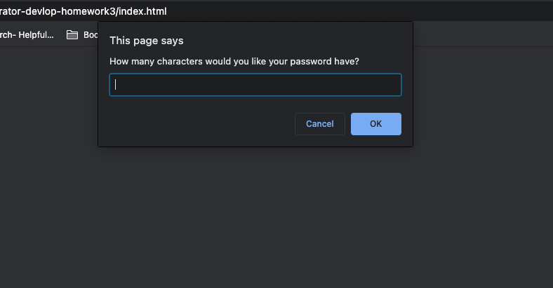
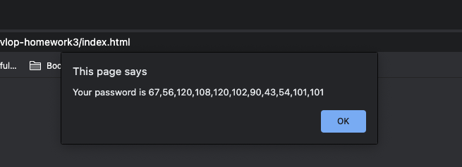

# jasdjames-password-generator-devlop-homework3

## Description 

The intended purpose of this project was to create a password generator. However, after over 30 hours of continual missteps and mistakes. I learned more than in not having the ultimate intended result than I would’ve otherwise. With the help of fellow classmate and the instructor leading in the right direction and to the resources ultimately lead me to small successes that I shall celebrate as a victory of will and full attempt. I left my missteps and commented out code as a testament to my many attempts at achieving the desired goal. 

## Installation

This project is listed in the the GitHub repostitory at this is link [GitHub Repository] (https://github.com/jasdjames/jasdjames-password-generator-devlop-homework3) 

This page has been deployed here [Page] (https://jasdjames.github.io/jasdjames-password-generator-devlop-homework3/) 

## Usage 

The page does not function as it should - I did not have a chance to change the password from its charcode back to a string. It only works when you choose all character types. 

## Credits

Erum and Will really helped me as much as they could trying to fix what ultuimatly became the most imporant learning experience 

# References 

[W3 Schools for Math logic] https://www.w3schools.com/jsref/jsref_obj_math.asp

[W3Schools-Operators] https://www.w3schools.com/js/js_comparisons.asp

[Conditional statements] https://www.w3schools.com/js/js_if_else.asp#:~:text=Use%20if%20to%20specify%20a,the%20first%20condition%20is%20false

[Includes] https://developer.mozilla.org/en-US/docs/Web/JavaScript/Reference/Global_Objects/Array/includes

[Ascii]http://www.asciitable.com/

[String to Ascii ] https://stackoverflow.com/questions/94037/convert-character-to-ascii-code-in-javascript 

[Slice] https://developer.mozilla.org/en-US/docs/Web/JavaScript/Reference/Global_Objects/Array/slice 

## License

 MIT License

Copyright (c) [2020] [JasDJames]

Permission is hereby granted, free of charge, to any person obtaining a copy
of this software and associated documentation files (the "Software"), to deal
in the Software without restriction, including without limitation the rights
to use, copy, modify, merge, publish, distribute, sublicense, and/or sell
copies of the Software, and to permit persons to whom the Software is
furnished to do so, subject to the following conditions:

The above copyright notice and this permission notice shall be included in all
copies or substantial portions of the Software.

THE SOFTWARE IS PROVIDED "AS IS", WITHOUT WARRANTY OF ANY KIND, EXPRESS OR
IMPLIED, INCLUDING BUT NOT LIMITED TO THE WARRANTIES OF MERCHANTABILITY,
FITNESS FOR A PARTICULAR PURPOSE AND NONINFRINGEMENT. IN NO EVENT SHALL THE
AUTHORS OR COPYRIGHT HOLDERS BE LIABLE FOR ANY CLAIM, DAMAGES OR OTHER
LIABILITY, WHETHER IN AN ACTION OF CONTRACT, TORT OR OTHERWISE, ARISING FROM,
OUT OF OR IN CONNECTION WITH THE SOFTWARE OR THE USE OR OTHER DEALINGS IN THE
SOFTWARE.
